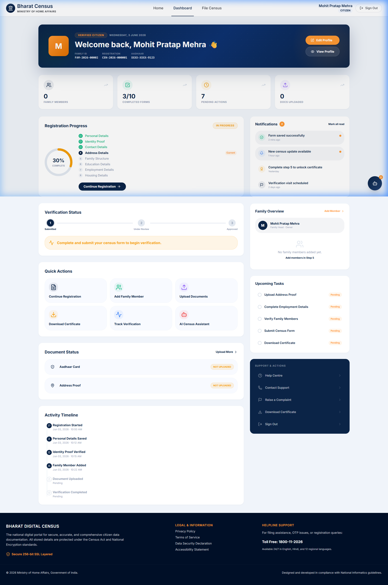
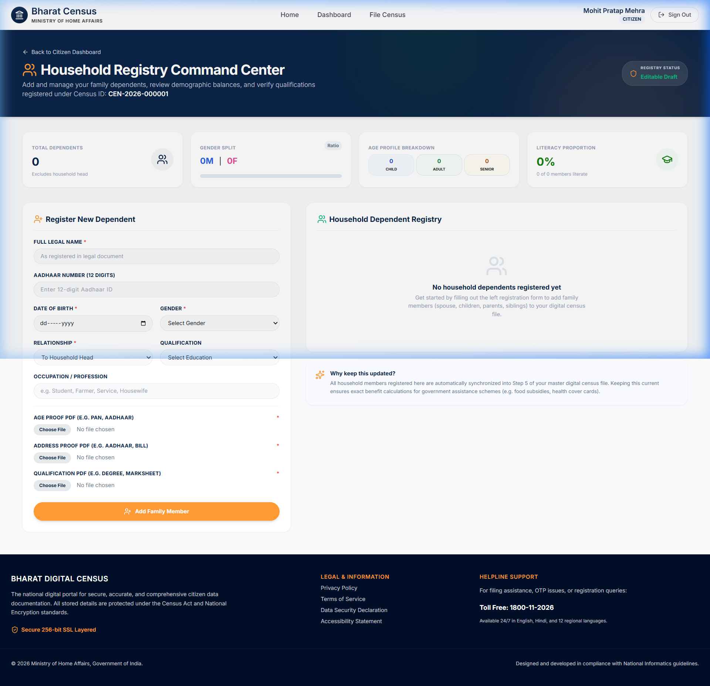
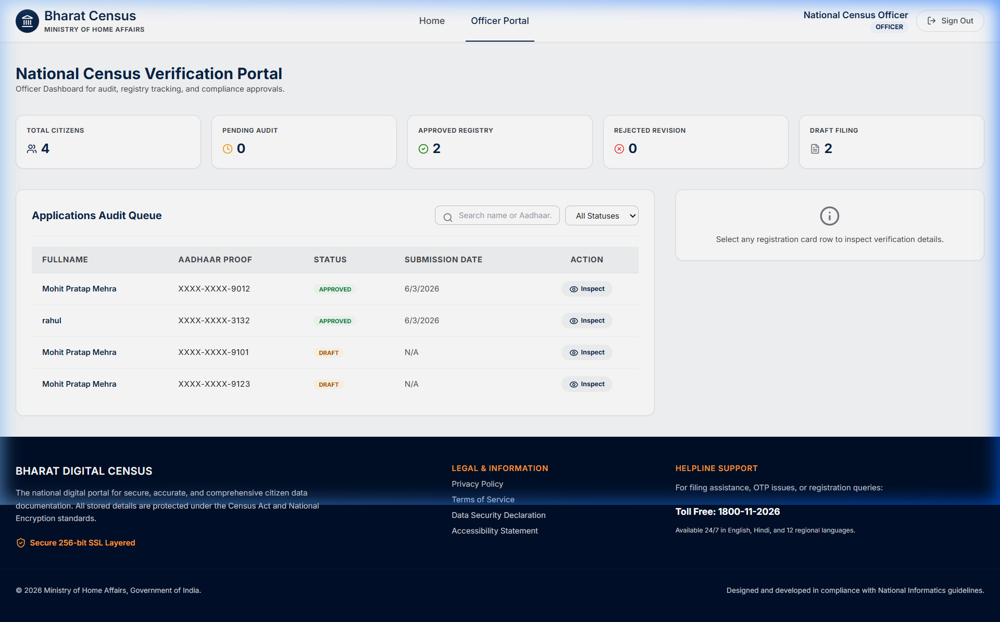

# 🇮🇳 Bharat Digital Census Portal 2026

A modern, high-fidelity, and secure digital census system designed to streamline the national household census registration process for citizens and facilitate seamless auditing and verification workflows for government census officers.

> [!WARNING]  
> **DISCLAIMER / WARNING:**  
> This project has been developed **strictly for educational and demonstration purposes**. It is not affiliated with, sponsored by, or endorsed by the Government of India or any official census department. All data collected and used within this application is mocked/simulated, and the system is not intended for production usage with real-world sensitive data.

---

## 📸 System Screenshots

### 1. Citizen Dashboard (Command Center)
A comprehensive control panel that greets registered citizens, displays their registration IDs, tracks progress, and illustrates real-world census metrics.


### 2. Household Dependent Registry Command Center
A custom sub-dashboard dedicated to managing family dependents. Calculates real-time literacy rates, gender ratios, and age demographics, with mandatory PDF document upload interfaces.


### 3. Census Officer Dashboard (Administration)
A secure workspace for national officers to audit submissions, view demographic breakdowns, search/filter registries, and download/inspect verified PDFs.


---

## 🌟 Key Features

### 👤 Citizen Interface & Command Center
- **Welcome Hero Card**: Personalized greetings display the Citizen's Profile Photo, Full Name, Family ID, and Census Registration ID with an elegant Indian tricolor glassmorphic styling.
- **Dynamic Stats Widgets**: Visualizes active statistics such as overall registration progress, total registered family size, and status indicators.
- **Interactive Population Globe**: Integrates a 3D Canvas-based global visualization built with React Three Fiber (`Three.js`) representing national growth and analytics.
- **Quick Action Links**: Rapid navigation buttons to edit profiles, start/resume registration, and add dependents.

### 📝 10-Step Census Registration Wizard
1. **Personal Details**: Legal Name, Gender, DOB, Marital Status, Nationality.
2. **Identity Proof**: Aadhaar validation.
3. **Contact Details**: Secure email and phone verification.
4. **Address Details**: State, District, Sub-District, Pin Code, House Details.
5. **Family Structure**: Add family members with custom demographics (synchronized automatically with the database).
6. **Education Details**: Literacy metrics, highest level of education.
7. **Employment Details**: Occupation categories and industry classification.
8. **Housing Details**: Ownership type, clean water access, power supply.
9. **Declarations**: Verification statements.
10. **Preview & Submission**: Final summary step allowing double-checking before committing the data.
*Features safe-resume capability preserving steps in the URL queries and database state updates to prevent data loss on browser refresh.*

### 👨‍👩‍👧 Dedicated Family Dependent Registry
- **Demographic Balance Gauges**: Computes dynamic male/female balance counters, age profiles (Children vs. Adults vs. Seniors), and household literacy percentages.
- **Mandatory PDF Verifications**: Requires citizens to upload valid PDF documents for:
  - *Age Proof* (PAN Card, Aadhaar, etc.)
  - *Address Proof* (Aadhaar, Utility Bills, etc.)
  - *Qualification Proof* (Marksheets, Degrees, Diplomas, etc.)
- **Binary Stream Downloads**: Encrypted, token-authenticated endpoints stream PDFs safely from the backend, preventing unauthorized URL access.

### 👮 Census Officer Dashboard
- **Real-Time Audits**: Shows active census submissions needing verification.
- **Registry Search & Filter**: Filter candidates by Aadhaar number, submission status, and states/districts.
- **Detailed Verification Panels**: Allows download, streaming, and inspection of all 3 mandatory PDF files for dependents before approving or rejecting applications.

### 🔒 Security & Backend Integration
- **Aadhaar-Based Authentication**: Citizen registration requires identity checking, accompanied by simulated 6-digit OTP verification codes (`123456`).
- **Role-Based Routing**: Strict React Router guards block unauthorized access between citizen accounts and officer accounts.
- **Safe Database Syncs**: Wizard data saves preserve existing dependent document paths through name/Aadhaar matching logic.
- **SQLite Database Self-Healing**: Automated startup checks alter tables on-the-fly to insert missing columns, ensuring database integrity.

---

## 🛠️ Technology Stack

### Frontend
- **Framework**: React.js 19 (Vite)
- **Styling**: Tailwind CSS & Modern Custom Vanilla CSS (Glassmorphism & harmonized color schemas)
- **Icons**: Lucide React
- **Graphics & Maps**: Three.js, React Three Fiber, React Simple Maps
- **APIs**: Axios (Authenticated JWT Interceptors)

### Backend
- **Server**: Node.js & Express
- **Database**: SQLite3
- **File Uploads**: Multer (configured with PDF extension limits & size checks)
- **Security**: JSON Web Token (JWT) & bcryptjs password hashing
- **Middlewares**: CORS, Helmet (HTTP header security)

---

## ⚙️ Installation & Setup

### Prerequisites
- Node.js (v18+ recommended)
- npm (Node Package Manager)

### Step 1: Install Dependencies
Run the install command in the root folder to set up packages for the root runner, frontend, and backend projects:
```bash
npm run install:all
```

### Step 2: Configure Environment Variables
Inside the `backend/` directory, create a `.env` file (or verify settings):
```env
PORT=5000
DATABASE_FILE=database.sqlite
UPLOAD_DIR=uploads
JWT_SECRET=supersecure_bharatcensus_secret_key_2026_goi
```

### Step 3: Run the Application
You can run the frontend (port `5173` or `5174`) and backend (port `5000`) servers concurrently using the dev command in the root:
```bash
npm run dev
```

### 👤 Demo Credentials
- **Census Officer (Admin)**:
  - Username: `admin`
  - Password: `admin123`
- **Citizen Account**:
  - Aadhaar: `123456789123`
  - OTP (Simulated): `123456`
